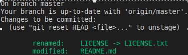

## Работа с репозиторием

[<_вернуться к содержанию_](./README.md)

Для создания локального репозитория, необходимо в консоли указать путь к проекту:

~~~
cd /home/user/documents/project
~~~

Далее выполнить команду:

~~~~
git init
~~~~

При создании репозитория в git с помощью команды `git init` git создает ветку по умолчанию с наименованием <strong>main</strong>.

## Контроль версий файлов

Для того, чтобы добавить файлы проекта под контроль версий необходимо выполнить команду `git add` с указанием всех файлов в репозитории ( _`git add .`_) либо указав конкретный файл (_`git add LICENSE`_).

Текущий статус файлов можно проверить с помощью команды `git status`. Пример ответа:

Для того, чтобы подготовить изменения к выгрузке в github, нужно выполнить команду `git commit`. Для названия коммита нужно добавить `-m "Название коммита"`.

 После создании нового репозитория на github, он вам сгенерирует команды. Их нужно будет только скопировать и вставить в консоль

Вот, как они будут выглядеть:
~~~
git remote add origin https://github.com/UserName/Project.git

git push -u origin master
~~~

